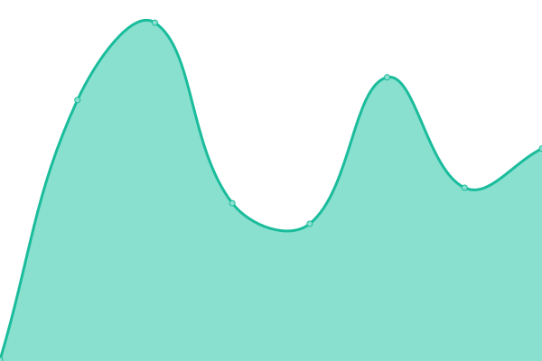
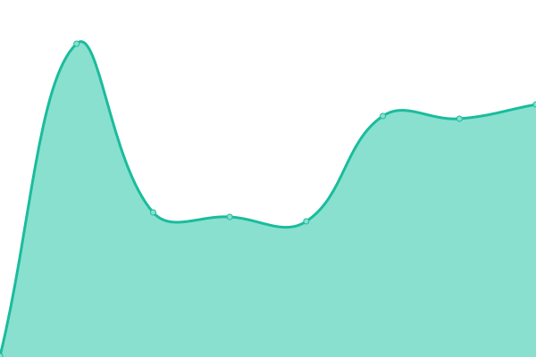
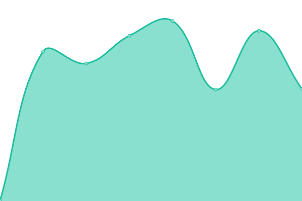

# [📈 Live Status](https://upptime.ching367436.me): <!--live status--> **🟩 All systems operational**

This repository contains the open-source uptime monitor and status page for [Upptime](https://upptime.js.org), powered by [Upptime](https://github.com/upptime/upptime).

With [Upptime](https://upptime.js.org), you can get your own unlimited and free uptime monitor and status page, powered entirely by a GitHub repository. We use [Issues](https://github.com/upptime/upptime/issues) as incident reports, [Actions](https://github.com/Ching367436/upptime/actions) as uptime monitors, and [Pages](https://upptime.ching367436.me) for the status page.

<!--start: status pages-->
<!-- This summary is generated by Upptime (https://github.com/upptime/upptime) -->
<!-- Do not edit this manually, your changes will be overwritten -->
<!-- prettier-ignore -->
| URL | Status | History | Response Time | Uptime |
| --- | ------ | ------- | ------------- | ------ |
|  [Ching367436's blog](https://blog.ching367436.me) | 🟩 Up | [ching367436-s-blog.yml](https://github.com/Ching367436/upptime/commits/HEAD/history/ching367436-s-blog.yml) | 

 246ms
     
 | 

<a href="https://upptime.ching367436.me/history/ching367436-s-blog">100.00%</a>
    

|  [BambooFox Main Site](https://bamboofox.cs.nycu.edu.tw) | 🟩 Up | [bamboo-fox-main-site.yml](https://github.com/Ching367436/upptime/commits/HEAD/history/bamboo-fox-main-site.yml) | 

 1212ms
     
 | 

<a href="https://upptime.ching367436.me/history/bamboo-fox-main-site">99.14%</a>
    

|  [BambooFox Main Site (Direct IP)](https://172.104.78.53) | 🟩 Up | [bamboo-fox-main-site-direct-ip.yml](https://github.com/Ching367436/upptime/commits/HEAD/history/bamboo-fox-main-site-direct-ip.yml) | 

 560ms
     
 | 

<a href="https://upptime.ching367436.me/history/bamboo-fox-main-site-direct-ip">99.62%</a>
    

|  [CTF: Frontend Unraveling Web Application: Master Obfuscated Code Odyssey](https://fuwamoco-flag-checker.ching367436.me) | 🟩 Up | [ctf-frontend-unraveling-web-application-master-obfuscated-code-odyssey.yml](https://github.com/Ching367436/upptime/commits/HEAD/history/ctf-frontend-unraveling-web-application-master-obfuscated-code-odyssey.yml) | 

 238ms
     
 | 

<a href="https://upptime.ching367436.me/history/ctf-frontend-unraveling-web-application-master-obfuscated-code-odyssey">100.00%</a>
    

|  [CTF: Starburst Cat Shop](https://starburst-cat-shop.ching367436.me/login) | 🟩 Up | [ctf-starburst-cat-shop.yml](https://github.com/Ching367436/upptime/commits/HEAD/history/ctf-starburst-cat-shop.yml) | 

 539ms
     
 | 

<a href="https://upptime.ching367436.me/history/ctf-starburst-cat-shop">100.00%</a>
    

|  [CTF: Login Panel](https://login-panel.ching367436.me) | 🟩 Up | [ctf-login-panel.yml](https://github.com/Ching367436/upptime/commits/HEAD/history/ctf-login-panel.yml) | 

 862ms
     
 | 

<a href="https://upptime.ching367436.me/history/ctf-login-panel">100.00%</a>
    

|  [CTF: Login Panel 2](https://login-panel-2.ching367436.me) | 🟩 Up | [ctf-login-panel-2.yml](https://github.com/Ching367436/upptime/commits/HEAD/history/ctf-login-panel-2.yml) | 

 758ms
     
 | 

<a href="https://upptime.ching367436.me/history/ctf-login-panel-2">100.00%</a>
    

|  [CTF: Curl Online](https://curl-online.ching367436.me/?url=example.com%2F) | 🟩 Up | [ctf-curl-online.yml](https://github.com/Ching367436/upptime/commits/HEAD/history/ctf-curl-online.yml) | 

 765ms
     
 | 

<a href="https://upptime.ching367436.me/history/ctf-curl-online">100.00%</a>
    

|  [CTF: Curl Online Pro](https://curl-online-pro.ching367436.me/?url=example.com%2F) | 🟩 Up | [ctf-curl-online-pro.yml](https://github.com/Ching367436/upptime/commits/HEAD/history/ctf-curl-online-pro.yml) | 

 536ms
     
 | 

<a href="https://upptime.ching367436.me/history/ctf-curl-online-pro">100.00%</a>
    

|  [CTF: E-Portfolio Baby](https://e-portfolio-baby.ching367436.me) | 🟩 Up | [ctf-e-portfolio-baby.yml](https://github.com/Ching367436/upptime/commits/HEAD/history/ctf-e-portfolio-baby.yml) | 

 643ms
     
 | 

<a href="https://upptime.ching367436.me/history/ctf-e-portfolio-baby">100.00%</a>
    

|  [CTF: E-Portfolio](https://e-portfolio.ching367436.me) | 🟩 Up | [ctf-e-portfolio.yml](https://github.com/Ching367436/upptime/commits/HEAD/history/ctf-e-portfolio.yml) | 

 726ms
     
 | 

<a href="https://upptime.ching367436.me/history/ctf-e-portfolio">100.00%</a>
    

|  [CTF: Flag Checker慂ㄹnti-debugging](https://flag-checker-anti-debugging.ching367436.me/) | 🟩 Up | [ctf-flag-checker-anti-debugging.yml](https://github.com/Ching367436/upptime/commits/HEAD/history/ctf-flag-checker-anti-debugging.yml) | 

 539ms
     
 | 

<a href="https://upptime.ching367436.me/history/ctf-flag-checker-anti-debugging">100.00%</a>
    

|  [CTF: Simple Site](https://simple-site.ching367436.me) | 🟩 Up | [ctf-simple-site.yml](https://github.com/Ching367436/upptime/commits/HEAD/history/ctf-simple-site.yml) | 

 492ms
     
 | 

<a href="https://upptime.ching367436.me/history/ctf-simple-site">100.00%</a>
    

|  [CTF: Hello World](https://hello-world-gcc.ching367436.me/?data%5Bname%5D=Ching367436&data%5Bcountry%5D=Taiwan) | 🟩 Up | [ctf-hello-world.yml](https://github.com/Ching367436/upptime/commits/HEAD/history/ctf-hello-world.yml) | 

 518ms
     
 | 

<a href="https://upptime.ching367436.me/history/ctf-hello-world">100.00%</a>
    

|  [CTF: Hello World 2](https://hello-world-ais3.ching367436.me/?name=Ching367436&country=Taiwan) | 🟩 Up | [ctf-hello-world-2.yml](https://github.com/Ching367436/upptime/commits/HEAD/history/ctf-hello-world-2.yml) | 

 473ms
     
 | 

<a href="https://upptime.ching367436.me/history/ctf-hello-world-2">100.00%</a>
    

|  [CTF: Hello World 3](https://hello-world-3-ais3.ching367436.me/?name=Ching367436&country=Taiwan) | 🟩 Up | [ctf-hello-world-3.yml](https://github.com/Ching367436/upptime/commits/HEAD/history/ctf-hello-world-3.yml) | 

 505ms
     
 | 

<a href="https://upptime.ching367436.me/history/ctf-hello-world-3">100.00%</a>
    

<!--end: status pages-->

[**Visit our status website →**](https://upptime.ching367436.me)

## 📄 License

- Powered by: [Upptime](https://github.com/upptime/upptime)
- Code: [MIT](./LICENSE) © [Anand Chowdhary](https://anandchowdhary.com), supported by [Pabio](https://pabio.com)
- Data in the `./history` directory: [Open Database License](https://opendatacommons.org/licenses/odbl/1-0/)
